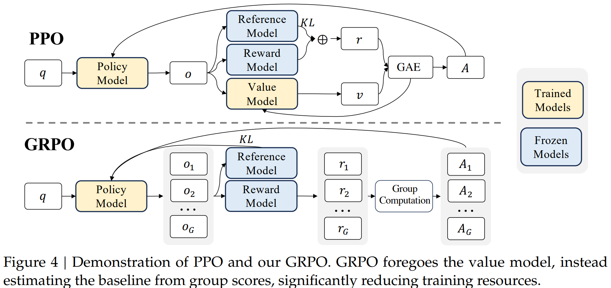

# RL Finetuning for LLMs

## Training Setup

1. **Optimizer:** AdamW with `b1 = 0.9`, `b2 = 0.95`, weight decay `0.1`
2. **Learning Rate Schedule:** Multi-step schedule
3. **Warmup:** Learning rate reaches peak after 2000 warmup steps
4. **Maximum Learning Rate:** `5.3e-4`
5. **Batch Size:** 4M tokens with 4K context length

---

## Proximal Policy Optimization (PPO)

Proximal Policy Optimization is an actor-critic RL algorithm widely used in the RL finetuning stage of LLMs.  
It optimizes LLMs by maximizing the following surrogate objective:

$$
J_{\text{PPO}}(\theta) = 
\mathbb{E}_{q \sim P(Q),\, o \sim \pi_{\theta_{\text{old}}}(O \mid q)} 
\left[
\frac{1}{|o|} 
\sum_{t=1}^{|o|}
\min\!\left(
\frac{\pi_\theta(o_t \mid q, o_{<t})}{\pi_{\theta_{\text{old}}}(o_t \mid q, o_{<t})} A_t,\;
\text{clip}\!\left(
\frac{\pi_\theta(o_t \mid q, o_{<t})}{\pi_{\theta_{\text{old}}}(o_t \mid q, o_{<t})},
1 - \epsilon,\;
1 + \epsilon
\right) A_t
\right)
\right].
$$

Optionally, a **per-token KL penalty** from a reference model can be added to the reward at each token:

$$
r_t = r_\phi(q, o_{\le t}) - \beta \, 
\log \frac{\pi_\theta(o_t \mid q, o_{<t})}{\pi_\text{ref}(o_t \mid q, o_{<t})}
$$

> As the above graph shows, PPO requires training a value model—another model of comparable size to the policy model—bringing substantial memory and computational burden.

---

## Group Relative Policy Optimization (GRPO)

To alleviate this, in the context of LLMs, only the last token is assigned a reward score by the reward model.  
**Group Relative Policy Optimization (GRPO)** removes the necessity of having an additional value function approximation:

$$
J_{\text{GRPO}}(\theta) = 
\mathbb{E}_{q \sim P(Q), \{o_i\}_{i=1}^G \sim \pi_{\theta_{\text{old}}}(O \mid q)}
\left[
\frac{1}{G} \sum_{i=1}^{G} 
\frac{1}{|o_i|} \sum_{t=1}^{|o_i|}
\min \Bigg(
\frac{\pi_\theta(o_{i,t} \mid q, o_{i,<t})}{\pi_{\theta_{\text{old}}}(o_{i,t} \mid q, o_{i,<t})} \hat{A}_{i,t}, \;
\text{clip}\Big(
\frac{\pi_\theta(o_{i,t} \mid q, o_{i,<t})}{\pi_{\theta_{\text{old}}}(o_{i,t} \mid q, o_{i,<t})}, 1-\epsilon, 1+\epsilon
\Big) \hat{A}_{i,t}
\Bigg)
\right]
- \beta D_{\text{KL}}(\pi_\theta \| \pi_{\text{ref}})
$$

Here, $\hat{A}_{i,t}$ is the advantage calculated based on **relative rewards of the outputs inside each group only**.

GRPO regularizes by directly adding the KL divergence between the trained policy and the reference policy to the loss, avoiding complicating the calculation of $\hat{A}_{i,t}$.  
Different from the KL penalty term used in PPO, the KL divergence is estimated with the following **unbiased estimator** (Schulman, 2020):

$$
D_{\text{KL}}(\pi_\theta \| \pi_{\text{ref}}) =
\frac{\pi_{\text{ref}}(o_{i,t} \mid q, o_{i,<t})}{\pi_\theta(o_{i,t} \mid q, o_{i,<t})} 
- \log \frac{\pi_{\text{ref}}(o_{i,t} \mid q, o_{i,<t})}{\pi_\theta(o_{i,t} \mid q, o_{i,<t})} - 1,
$$

which is guaranteed to be positive.

---

## DeepSeekMath-RL 7B Training Details

We conduct RL based on **DeepSeekMath-Instruct 7B**. The training data for RL are **chain-of-thought-format questions** from GSM8K and MATH, derived from SFT data (~144K questions).  

- Only GSM8K and MATH are used to investigate the impact of RL on benchmarks lacking data.  
- Reward model training follows Wang et al., 2023b. Initial reward model is trained based on **DeepSeekMath-Base 7B** with a learning rate of `2e-5`.  
- For GRPO: policy model learning rate `1e-6`, KL coefficient `0.04`, 64 outputs sampled per question.  
- Maximum sequence length: 1024; batch size: 1024. Policy model performs a single update per exploration stage.  

### Evaluation

- **DeepSeekMath-RL 7B** evaluated on benchmarks following DeepSeekMath-Instruct 7B.  
- GSM8K and MATH with chain-of-thought reasoning are considered **in-domain**; others are **out-of-domain**.  

**Results Highlights (Table 5):**  

1. DeepSeekMath-RL 7B achieves **88.2% on GSM8K** and **51.7% on MATH**, outperforming all open-source models in the 7B–70B range and most closed-source models.  
2. Trained only on chain-of-thought-format instruction tuning data of GSM8K and MATH, starting from DeepSeekMath-Instruct 7B. Despite limited data, it **outperforms DeepSeekMath-Instruct 7B across all evaluation metrics**, demonstrating the effectiveness of RL finetuning.

